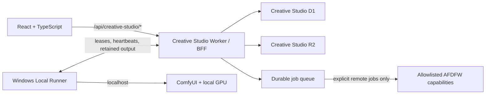

# Creative Studio

Creative Studio is Angelo's private, standalone creative workstation for turning an idea or retained source into images, video, music, CreativeDNA, and reusable training evidence.

**Idea or source -> CreativeDNA -> generate -> retain -> review -> evolve**

[Open the production studio](https://cs.angelotoborg.com) | [Build reality](docs/BUILD_REALITY.md) | [Local-first guide](docs/LOCAL_FIRST.md)

Creative Studio owns its interface, projects, typed contracts, jobs, media, artifact history, model library, training records, and review decisions. Production uses one narrow AFDFW approved-session handoff; AFDFW generation is a separate, optional image/music route that must be selected explicitly. AFDFW is not the application shell and is never exposed to the browser through a generic proxy.

## The four working surfaces

| Surface | Purpose | Direct actions |
| --- | --- | --- |
| **Home** | Start from the newest or selected image, audio file, or video and see its real CreativeDNA profile. | Upload, analyze, create an image, animate, make a song, or train. |
| **Create** | Run the complete media workflow without moving between pages. | Choose Image, Video, Song, or Train; select a model and source; edit the direction and graphical settings; submit. |
| **Work** | Follow the durable production lifecycle for the active project. | Resolve owner actions, inspect running jobs, cancel or retry, review retained results, extend, animate, reuse, or evolve. |
| **Studio** | Manage the workspace behind creation. | Create and switch projects, browse media and CreativeDNA memory, import models, and inspect or pair local systems. |

Legacy deep links still resolve into the correct Work or Studio section, but the primary desktop and mobile navigation stays limited to these four destinations.

## What the app can do

### Create across media

- **Images:** generate through an imported ComfyUI workflow, choose 1:1, 9:16, 16:9, 3:4, or 4:3, and use graphical quality, steps, and seed controls when the model exposes them. Image jobs default to a bounded fast mode; larger or slower settings require an explicit Custom choice.
- **Video:** generate from text or a retained first frame, animate an image in one action, extend a retained clip, and create 5, 10, 15, 30, or 60 second outputs when the selected workflow supports the workload. A normal video request creates two sequential, independent results: **Aligned** follows the authored direction and **Discovery** uses a random-DNA-led interpretation. Evolution can instead create Refine, Correct, and Discovery branches.
- **Music:** derive editable song ideas from retained art and CreativeDNA, keep lyrics optional and separate, and compile the final prompt for the selected model. MiniMax Music 3 receives its required structured caption; Stable Audio receives a concise natural-language prompt. The exact authored brief, compiled prompt, model profile, and Gemma provenance remain stamped on the job.
- **Workflows as models:** import a ComfyUI JSON once in **Studio -> Models**, inspect detected inputs and models, edit allowlisted scalar controls graphically, and save immutable revisions. Create selects compatible owner-library workflows directly; it never asks for a JSON during ordinary generation.

Every submitted workflow job retains its exact revision, SHA-256 content stamp, model files, prompt, parameters, media bindings, CreativeDNA version, source lineage, timing, and retry lineage.

### Build and train CreativeDNA

CreativeDNA is a versioned cross-media profile, not a hidden prompt or a model name. It keeps eight measured dimensions, confidence, provenance, rights, source descriptions, lineage, and the reusable generation direction.

- Analyze consented image, audio, and video uploads with the Local Runner, deterministic media measurements, FFmpeg/Sharp, and the bundled Gemma 4 multimodal ComfyUI workflow.
- Retain both a detailed `longSummary` and a concise reusable `shortSummary`, along with the exact analysis prompt, model, workflow version, ComfyUI prompt ID, and inference settings.
- Create immutable root and child DNA versions instead of overwriting history.
- Compare a trained version with its baseline and source evidence before activation. Approval and rejection both require a note; only approved trained DNA can generate or become another training baseline.
- Turn accepted artifact prompts and settings into fresh training evidence exactly once. Failed or cancelled training releases its reservation instead of silently consuming it.

CreativeDNA analysis is evidence-backed profile synthesis. It does not change image or video model weights.

### Train an ACE-Step music LoRA

The separate music-model path performs real local ACE-Step 1.5 LoRA training:

1. Select or upload at least three consented recordings.
2. Let Gemma draft grounded music captions and local Whisper draft vocal lyrics.
3. Review every caption and lyric field and add a dataset approval note.
4. Run preprocessing and GPU training through the pinned ACE-Step runtime.
5. Inspect the retained checkpoint and explicitly approve it before project activation.

The proof, balanced, and deep recipes remain visible, and the checkpoint hash, size, dataset, recipe, progress, evaluation notes, and activation decisions stay durable. The runner advertises this capability only when the official runtime and real Base, VAE, and Qwen encoder weights are installed. An active adapter binds only to a compatible ACE-Step workflow with detected LoRA file and strength controls.

### Keep a durable production record

- Generation and training continue without an open browser.
- Every completed result is retained and size-verified before a job becomes complete; accept, reject, and archive do not control retention.
- Work is ordered newest to oldest. Archived artifacts stay collapsed, video cards use lazy first-frame JPEGs, and only an explicitly opened video mounts a player.
- Image, audio, and video review use the correct media controls. Accept and reject require a note, and the append-only decision history keeps the actor and time.
- Cancellation preserves the original run and immediately exposes recovery. Retry creates a new lineage-linked job rather than rewriting history.
- A 20-minute threshold creates an awareness warning without cancelling legitimate long local renders. Workload evidence exposes resolution, steps, frames, duration, models, and observed exact-revision timing when available.

## Runtime modes

| Mode | Start | Execution and storage |
| --- | --- | --- |
| **Local-first** | `npm run local` | Vite, Wrangler-local BFF, local D1/R2, Local Runner, ComfyUI, and this machine's GPU. No Cloudflare or AFDFW runtime traffic. |
| **Remote production** | [cs.angelotoborg.com](https://cs.angelotoborg.com) | Cloudflare Access, Creative Studio Worker/D1/R2/Queue, and a paired Windows Local Runner. AFDFW remains a separate optional image/music route. |
| **UI development** | `npm run dev` | Explicitly labeled browser-local metadata and preview behavior only. It starts empty and cannot retain real uploads, pair runners, or train models. |

Local and remote stores are intentionally separate. Nothing synchronizes or publishes local projects, media, settings stamps, or decisions in the background.

## Run locally on this workstation

### Requirements

- Windows PowerShell and the repository checkout.
- Node.js 24 and npm. The current verified toolchain is Node `24.16.0` and npm `11.13.0`.
- ComfyUI available at `http://127.0.0.1:8188`.
- The model files and custom nodes required by the workflows you intend to execute.
- At least one ComfyUI **API-format** workflow for real generation. A UI-format graph may be retained and edited, but it is not executable until exported in API format.
- Chrome installed when running the configured Playwright suite.

### Start the complete local stack

```powershell
npm ci
npm run local
```

Open the URL printed by the launcher (`http://127.0.0.1:5173` by default). The command applies local migrations, starts or reuses the BFF on port `8787`, creates or reuses an ACL-protected localhost runner credential outside the repository, starts Local Runner 1.9.1, and starts Vite.

Then:

1. Create a project in **Studio -> Project**.
2. Import an API-format ComfyUI workflow in **Studio -> Models**.
3. Upload or select a source from Home, Create, or **Studio -> Media**.
4. Choose the model in Create and submit.
5. Follow the durable run and review its result in Work.

Press `Ctrl+C` in the launcher terminal to stop the processes it started. A BFF that was already running is reused and is not stopped. Local D1/R2 state lives under the ignored `.wrangler` directory.

For UI-only development, run:

```powershell
npm run dev
```

For split local diagnostics:

```powershell
npm run db:local
npm run dev:worker
```

Then, in a second PowerShell window:

```powershell
$env:VITE_CREATIVE_STUDIO_ADAPTER = "http"
$env:VITE_CREATIVE_STUDIO_LOCAL = "true"
npm run dev
```

The browser still calls only `/api/creative-studio/*`; Vite proxies those requests to the localhost BFF.

## Pair this workstation with the remote studio

1. Open **Studio -> System -> Runners** in the production app.
2. Create a shown-once machine credential.
3. From this repository, run:

```powershell
powershell -ExecutionPolicy Bypass -File .\scripts\install-local-runner.ps1
```

The installer prompts for that bearer credential, stores the configuration at `%LOCALAPPDATA%\Creative Studio Runner\config.json` with a current-user ACL, registers an at-logon task, and starts the runner. Creative Studio stores only its hash, while the installed runner continues using the credential until the machine is revoked from the same Runners panel. ComfyUI remains localhost-only.

Install the optional pinned ACE-Step 1.5 runtime and Base checkpoints once:

```powershell
powershell -ExecutionPolicy Bypass -File .\scripts\setup-ace-step-training.ps1
```

The default runtime location is `D:\AI\ACE-Step-1.5`, outside the repository. Training requires a GPU with at least 20 GB total VRAM and refuses to start until at least 18 GB is free.

Run one foreground runner diagnostic with the installed configuration:

```powershell
$env:CS_RUNNER_CONFIG = "$env:LOCALAPPDATA\Creative Studio Runner\config.json"
npm run runner:once
```

Never print or commit a runner credential; keep the installed configuration outside the repository.

## Architecture and ownership



- The frontend imports shared contracts but no AFDFW frontend code, routes, CSS, components, or branding.
- Browser traffic is limited to `/api/creative-studio/*`. Unknown API paths return `404`.
- Creative Studio D1 owns projects, DNA versions, workflows, jobs, training, runners, artifacts, evidence, and decisions.
- Creative Studio R2 owns uploaded media, every completed result, and retained video thumbnails.
- Local workflow jobs are claimed by the authenticated machine runner and never enter the AFDFW queue consumer.
- AFDFW access is method-and-path allowlisted for approved session handoff and explicitly selected image/music generation only. There is no arbitrary forwarder.
- Accepting an artifact changes only Creative Studio review and training evidence. It never mutates AFDFW profile, Core, feed, or canonical state.
- Commercial reference identity may stay in provenance while being excluded from provider prompts.

See [docs/ARCHITECTURE.md](docs/ARCHITECTURE.md) and [docs/BACKEND_CONTRACT.md](docs/BACKEND_CONTRACT.md) for the complete contract.

## Cloudflare production boundary

Production is private behind the `Angelo only` Cloudflare Access policy.

| Resource | Production binding |
| --- | --- |
| Worker | `creative-studio` |
| D1 | `creative-studio` |
| R2 | `creative-studio-artifacts` |
| Queue | `creative-studio-jobs` -> `creative-studio-jobs-dlq` |
| Recovery | Hourly scheduled sweep |
| Local runner API | `runner.cs.angelotoborg.com` with revocable bearer credentials and no application shell |
| Optional backend | Same-account `AFDFW` service binding to `art-feed-dfw` |

The production configuration disables the generic `workers.dev` route. Snapshot reads replace many parallel requests, browser polling runs only for visible active work, remote polling is bounded and backs off after failures, and the Local Runner uses a unified claim/heartbeat cadence. `npm run check:cloudflare-free` enforces a modeled baseline of at most 2,904 Worker requests per day for one remote runner, one visible active browser, and the hourly recovery trigger. Extra tabs, enrolled runners, owner actions, Queue deliveries, and other account Workers add requests; this is not a hard account ceiling.

See [docs/CLOUDFLARE_FREE_BUDGET.md](docs/CLOUDFLARE_FREE_BUDGET.md) for the allowance model and rate-limit response.

## Known boundaries

- New installations start empty. No project, artifact, media, or generation result is seeded as placeholder data.
- Media uploads and runner generation outputs are limited to 100 MB each, retained video thumbnails to 2 MB, and workflow JSON imports to 1 MB.
- Models and System can be viewed before a project exists, but media, memory, and model import require an active project.
- Real generation requires the selected workflow's models and custom nodes to exist in ComfyUI.
- UI-format ComfyUI JSON is not automatically converted into an executable API graph.
- CreativeDNA analysis changes a versioned evidence profile, not model weights.
- ACE-Step music LoRA is implemented; image and video model training remain future work.
- Non-instrumental ACE-Step datasets require a working local Whisper executable for draft transcription. Adapter approval does not claim a scored A/B quality proof; automatic validation generations are not implemented yet.
- Image, audio/music, and video workflow execution are supported. 3D workflows may be inspected but are rejected at execution in this release.
- Video duration choices depend on a recognized control in a compatible workflow. Two-version and three-branch video requests create sequential local jobs, so their total time includes each render.
- Runtime estimates require comparable completed evidence and exclude unknown queue or cold-model-load time.
- D1/R2 retention is durable, but current list and snapshot APIs expose bounded recent windows without pagination. Older retained records can therefore fall outside the browser's current history feed.
- Local and remote data do not synchronize automatically.
- AFDFW is optional and never an implicit fallback when a local workflow is missing.

## Verify

Run the canonical full source and browser gate:

```powershell
npm run check:all
```

`npm run check` runs ESLint, browser-domain Vitest, Workers-runtime tests against isolated D1 migrations, the Local Runner self-test, environment validation, the Cloudflare free-tier guard, TypeScript, the production build, and the source secret scan. `check:all` adds the serial desktop/mobile Playwright matrix.

The current four-surface release passed 69 browser-domain tests, 26 Workers-runtime tests, the Local Runner/environment/free-tier/build/secret gates, and 32 Playwright checks with 26 exercised passes plus six intentional device-specific skips. Rendered checks at 390 x 844 and 1440 x 900 reported zero horizontal overflow and zero console errors or warnings. Exact release evidence lives in [docs/BUILD_REALITY.md](docs/BUILD_REALITY.md).

Production configuration can be checked without deploying:

```powershell
npm run check:env:production
```

The production release command runs the full gate, validates production configuration, applies remote D1 migrations, and publishes the Worker and assets. It assumes the Cloudflare D1, R2, Queues, custom domains, Access application, and service binding are already provisioned and Wrangler is authenticated:

```powershell
npm run deploy:production
```

## Useful commands

| Command | Purpose |
| --- | --- |
| `npm run local` | Start the complete local-first stack. |
| `npm run dev` | Start the UI-only development adapter. |
| `npm run dev:worker` | Start the Wrangler-local Worker on port 8787. |
| `npm run runner:once` | Run one foreground Local Runner cycle. |
| `npm run runner:check` | Run the Local Runner self-test. |
| `npm run check` | Run the complete non-browser source, runtime, build, and secret gate. |
| `npm run check:all` | Add the desktop/mobile Playwright matrix to `check`. |
| `npm run check:env:production` | Validate production bindings and environment without publishing. |
| `npm run db:production` | Apply production D1 migrations. This changes remote state. |
| `npm run deploy:production` | Verify, migrate, and deploy production. |

## Repository map

```text
src/                 React application and four product surfaces
shared/contracts/    Typed browser/Worker/runner domain and API contracts
worker/              Creative Studio Worker, durable jobs, storage, retention, and adapters
runner/              Windows Local Runner, ComfyUI execution, media analysis, and ACE-Step training
migrations/          Creative Studio-owned D1 schema history
tests/unit/          Browser-domain and contract tests
tests/worker/        Workers-runtime integration tests
tests/e2e/           Desktop/mobile product and accessibility flows
scripts/             Local launcher, runner installers, validation, and release guards
docs/                Architecture, contracts, prompt profiles, operations, and verified reality
```

## Documentation

- [Local-first operation](docs/LOCAL_FIRST.md)
- [Architecture](docs/ARCHITECTURE.md)
- [Backend contract and AFDFW allowlist](docs/BACKEND_CONTRACT.md)
- [Model-specific prompt profiles](docs/MODEL_PROMPT_PROFILES.md)
- [Cloudflare free-plan budget](docs/CLOUDFLARE_FREE_BUDGET.md)
- [Production release checklist](docs/PRODUCTION_READINESS.md)
- [Verified build and production reality](docs/BUILD_REALITY.md)

`docs/BUILD_REALITY.md` is authoritative for current executable versions, migrations, verification counts, and production deployment state. Architecture and readiness documents may retain historical rollout version labels.
