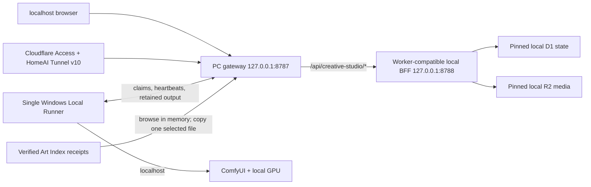

# Creative Studio

Creative Studio is Angelo's private PC workstation for creating images, video, songs, and 3D meshes, and training image or music style adapters from selected artwork.

**Idea or source -> CreativeDNA -> generate -> retain -> review -> evolve**

[Open the remote studio](https://cs.angelotoborg.com) | [Build reality](docs/BUILD_REALITY.md) | [Local-first guide](docs/LOCAL_FIRST.md)

Creative Studio owns its interface, projects, typed contracts, jobs, media, artifact history, model library, training records, and review decisions. The approved production architecture is PC-hosted: the UI, API, D1-compatible state, R2-compatible media, Local Runner, and ComfyUI work all run on this workstation. Cloudflare is only the Access-protected tunnel doorway; AFDFW is not the application shell or an implicit fallback.

The guarded cloud-to-PC migration, PC-host installation, Cloudflare Worker execution retirement, HomeAI Tunnel/DNS cutover, and authenticated remote desktop/mobile QA completed on 2026-09-03. Localhost and `cs.angelotoborg.com` now reach the same PC authority.

## The four working surfaces

| Surface | Purpose | Direct actions |
| --- | --- | --- |
| **Ideas** | Explore directions using optional project and CreativeDNA context. | Story Bank, Love Loop, and Overnight Studio. |
| **Create** | Make media in one focused workspace. | Choose Image, Video, Song, or 3D mesh; add an optional source (required for mesh); describe the result; generate. Train my style opens real image LoRA training. |
| **Work** | Follow the durable production lifecycle for the active project. | Resolve owner actions, inspect running jobs, cancel or retry, review retained results, extend, animate, reuse, or evolve. |
| **Studio** | Manage the workspace behind creation. | Create and switch projects, browse media and CreativeDNA memory, import models, and inspect or pair local systems. |

Legacy deep links still resolve into the correct Work or Studio section, but the primary desktop and mobile navigation stays limited to these four destinations.

### Video sound

New video prompts default to scene sound: natural location ambience, material textures, and sparse Foley timed to visible action. The prompt planner describes concrete sound sources, distance and reverberation, onset and decay, and quiet moments. It adds music only when the brief requests it or a musical source belongs to the scene. Speech settings and explicit silent/original-audio extensions remain separate.

Reusing a setup removes the former injected synth/percussion default; existing jobs and retained videos keep their original provenance. New sound-requested videos must contain a decoded audible track before completion. This checks missing or silent audio, not synchronization or artistic quality; inspect the rendered result. LTX generates sound jointly with video, so the local model's fidelity remains a practical limit.
### Image style training and 3D

**Train my style** uses 3–40 selected, training-consented images. Review the captions before starting native ComfyUI training. The first supported base is the installed Stable Diffusion 1.5 checkpoint, with 512px copies, rank 8, batch size one, gradient checkpointing, and offloading. Proof, balanced, and deep run 100, 500, or 1,500 steps. The checkpoint stays private and review-required; approval creates a matching SD1.5 generation workflow. Its learned weights do not apply to unrelated image, video, song, or mesh models. Native ComfyUI training nodes remain experimental, and training completion alone is not a quality assessment.

**3D mesh** binds a selected image to a Hunyuan3D workflow and retains a validated GLB download. GLB can be opened in a 3D application; this release does not include an embedded mesh viewer. The bundled API graphs are `runner/workflows/hunyuan3d-image-to-mesh.json` and `runner/workflows/minimax-music3-local.json`; import them into the desired project through Models. The song graph executes local MiniMax Music3 weights through ComfyUI. `runner/workflows/ltx-fast-pc-5s.json` is a verified single-pass 0.2 MP LTX video graph for this PC, with audio and tiled decoding; it avoids the native latent upscaler that showed excessive shared-memory pressure during live testing.

Run `npm run desktop:install` to create a **Creative Studio** desktop shortcut. It opens the local host in a dedicated Chrome or Edge app window. The installed PC host remains the background owner; remote access uses the same state at the protected tunnel address.

Optional LM Studio prompt help is available for text-to-video without a source image. Set the PC host process environment `CS_LM_STUDIO_MODEL` to an already loaded LM Studio instance ID (and optionally `CS_LM_STUDIO_URL`, restricted to loopback; default `http://127.0.0.1:1234`). The helper verifies residency, releases Comfy memory through the GPU coordinator, makes one bounded text request, records the actual LM model/provider, and unloads LM before rendering. It never downloads or auto-loads a model. An unconfigured host continues using its existing Comfy/Gemma helper; a configured but unavailable LM instance reports an explicit failure.

## What the app can do

### Create across media

The production Simple Create experience keeps the default path to one screen: choose the media kind, drop in a source or open the retained-work gallery, write the prompt, adjust only the essential graphical controls, and generate. Model selection, workflow revisions, World continuity, dialogue, recipes, evolution, and exact tuning remain available under **More creative controls** instead of lengthening every ordinary creation. Newest retained results stay in the same Create surface in a lazy thumbnail rail; one selected image, video, or audio result can be inspected, downloaded, opened in Artifact History, or reused as the next source without leaving Create. Any restored non-default setting opens visibly, and a disabled Generate action explains the exact blocker instead of failing silently.

- **Images:** generate through an imported ComfyUI workflow, choose 1, 2, or 4 separately retained outputs, choose 1:1, 9:16, 16:9, 3:4, or 4:3, and use graphical quality, steps, and seed controls when the model exposes them. Image jobs default to a bounded fast mode; larger or slower settings require an explicit Custom choice.
- **Video:** generate from text or a retained first frame, animate an image in one action, extend a retained clip, and create 5, 10, 15, 30, or 60 second outputs when the selected workflow supports the workload. Extend defaults to **New sound**: a combined result keeps the source soundtrack and joins or crossfades newly generated continuation audio, while a continuation-only result retains its generated soundtrack. The existing **Source audio only** and **Silent** policies remain explicit alternatives. New-sound jobs wait for Local Runner 1.20 or newer and fail visibly if the selected workflow returns no audible continuation sound. Choose 1, 2, or 4 separately retained results. A direct **Animate x4** action from Home, retained media, or a result creates an **Exact**, **Enhanced**, **Left Field**, and **Awe** board: the authored motion, a local-Gemma refinement, a 75%-random-DNA interpretation, and a 90%-random-DNA beautiful-strange interpretation. Each version is a distinct durable job with its own seed, role, prompt lineage, and settings. Speech is first-class: **No dialogue** keeps designed ambience, effects, sparkling synth arpeggios, buoyant electronic rhythm, wistful hooks, and dreamy nocturnal-city texture; **Simple line** reduces an idea to one coherent line; **Exact script** preserves the supplied words verbatim and prohibits improvisation. **Write full script** opens a compact, model-aware builder where one seed phrase becomes a complete duration-matched scene with action, camera, environment, lighting, ending, and nonverbal sound. For animation Gemma sees the selected owned image; for extension it sees the source video's extracted final frame. Dialogue stays in a separate optional exact field, so leaving it blank never silences the sound design. Nothing changes until **Use full script** is chosen. The generated scene, optional dialogue, owner edit revision, builder and generation workflow revisions, source-materialization method, verified prompt derivation, exact final job prompt, model, and ComfyUI prompt remain stamped on every resulting video. `Enhance prompt` remains a separate control for editable model-specific MiniMax H3, LTX 2.5, or generic motion direction. Evolution can instead create Refine, Correct, and Discovery branches.
- **Music:** derive editable song ideas from retained art and CreativeDNA, keep lyrics optional and separate, and compile the final prompt for the selected model. MiniMax Music 3 receives its required structured caption; Stable Audio receives a concise natural-language prompt. The exact authored brief, compiled prompt, model profile, and Gemma provenance remain stamped on the job.
- **Workflows as models:** import a ComfyUI JSON once in **Studio -> Models**, inspect detected inputs and models, edit allowlisted scalar controls graphically, and save immutable revisions. Create selects compatible owner-library workflows directly; it never asks for a JSON during ordinary generation.

Every submitted workflow job retains its exact revision, SHA-256 content stamp, model files, prompt, parameters, media bindings, CreativeDNA version, source lineage, timing, and retry lineage.

### Resume, scout, and reuse a direction

- **Creative Sessions:** Create autosaves the current project-scoped draft in this browser's device storage, including its retained source reference, direction, media kind, workflow/revision, graphical settings, dialogue, full-script seed, editable scene, optional spoken line, durable request/revision, and Scout/Explore/Master goal. Home can reopen the newest draft, and a successfully queued submission clears it. Sessions do not live in D1, follow the owner to another device, or replace durable jobs; completed full-script drafts and their owner edit revisions do live durably in Creative Studio storage.
- **Scout direction boards:** choosing Scout for an image with an image source queues Refine, Correct, and Discovery as three independent durable evolution jobs under one study ID. Their retained results stay grouped for comparison while each branch keeps its exact prompt, workflow revision, settings, source provenance, and evolution role.
- **Generation Recipes:** Create can save and reload an owner-scoped recipe containing the exact executable workflow revision, model identifier, prompt profile, scalar parameters, supported source kinds, and Scout/Explore/Master tier. D1 migration `0014_generation_recipes.sql` adds durable recipe and recipe-evidence records. Evidence can be recorded from an owned terminal job only when its project scope, modality, workflow revision, parameters, model, prompt profile, and executable workflow inputs match. To keep routine PC-host refresh bounded, the consolidated snapshot returns the 50 most recently updated active recipes and the 10 newest evidence observations per recipe; an explicit recipe detail request returns up to 100 observations.

### Creative Worlds and character continuity

Creative Worlds are project-scoped, versioned continuity records. A World can contain characters, places, and objects; `must`, `prefer`, and `avoid` rules scoped by modality; and provenance-bearing visual or retained-work references. Every update uses an expected version so a stale browser cannot silently overwrite newer canon.

Generation can opt into one active World and an exact selection of entity, rule, and canonical-reference versions for a local ComfyUI image or video. The local BFF re-loads those owner-scoped records, rejects stale or retired selections, compiles the provider-safe continuity directive, and stamps the exact selected records, versioned redaction references, and compiled text into the durable job. Later World edits therefore cannot rewrite what an earlier result was asked to preserve. Commercial reference identity remains provenance-only; the BFF checks the complete submitted prompt against every stored World reference before anything can reach ComfyUI.

Artifact acceptance and canon are deliberately separate decisions. Accepting a result makes its prompt and settings eligible for CreativeDNA training; it does **not** make the result part of a World. Promoting an accepted, retained artifact to canon requires a second explicit confirmation, a note, selected continuity facets, an active entity version, and the acceptance evidence. The append-only promotion record keeps the actor, reference version, source artifact, and review linkage.

The older Project context toggle remains an optional, off-by-default prompt aid. It is useful for quick local image/video direction, but it is not World canon and does not create a structured continuity stamp.

### Build and train CreativeDNA

CreativeDNA is a versioned cross-media profile, not a hidden prompt or a model name. It keeps eight measured dimensions, confidence, provenance, rights, source descriptions, lineage, and the reusable generation direction.

- Analyze consented image, audio, and video uploads with the Local Runner, deterministic media measurements, FFmpeg/Sharp, and the bundled Gemma 4 multimodal ComfyUI workflow.
- Retain both a detailed `longSummary` and a concise reusable `shortSummary`, along with the exact analysis prompt, model, workflow version, ComfyUI prompt ID, and inference settings.
- Create immutable root and child DNA versions instead of overwriting history.
- Compare a trained version with its baseline and source evidence before activation. Approval and rejection both require a note; only approved trained DNA can generate or become another training baseline.
- Turn accepted artifact prompts and settings into fresh training evidence exactly once. Failed or cancelled training releases its reservation instead of silently consuming it.

CreativeDNA analysis is evidence-backed profile synthesis. It does not change image or video model weights.

### Train an ACE-Step music LoRA

The separate music-model path performs real local ACE-Step 1.5 LoRA training:

1. Select or upload at least three consented recordings.
2. Let Gemma draft grounded music captions and local Whisper draft vocal lyrics.
3. Review every caption and lyric field and add a dataset approval note.
4. Run preprocessing and GPU training through the pinned ACE-Step runtime.
5. Inspect the retained checkpoint and explicitly approve it before project activation.

The proof, balanced, and deep recipes remain visible, and the checkpoint hash, size, dataset, recipe, progress, evaluation notes, and activation decisions stay durable. The runner advertises this capability only when the official runtime and real Base, VAE, and Qwen encoder weights are installed. An active adapter binds only to a compatible ACE-Step workflow with detected LoRA file and strength controls.

### Keep a durable production record

**Angelo, adored** is an opt-in local Autopilot ritual that creates three private visual love letters per day: two fast images and one fast five-second video, shuffled across stable morning, afternoon, and evening windows. One Home action selects the best eligible prompt-only image and video workflows for the active project. The exact times, modality order, concepts, seeds, CreativeDNA dimensions, workflow revisions, recipes, and privacy policy are deterministic and stamped so every result is explainable and repeatable.

The provider prompt uses only symbolic roles—`the artist` and `his husband`—plus bounded numeric CreativeDNA direction. It never sends Angelo's name, account metadata, project text, filenames, source descriptions, or an unconsented likeness to ComfyUI. Dialogue, fake quotations, captions, and identifiable unreferenced people are prohibited while ambience, tactile sound, and restrained original music remain available in video. Manual jobs retain higher priority. The Local Runner materializes at most one due creation when ComfyUI is healthy, so the browser may close and no new Cloudflare cron, Queue poll, browser timer, or AFDFW request is introduced. Pause or turn off stops future work without deleting history; every completion remains retained and undecided until Angelo explicitly reviews it.

**Overnight Studio** turns an approved CreativeDNA, an optional Creative World, and the owner's prompt-only ComfyUI workflows into a bounded night of new work. A default run asks local Gemma for one coherent story, three fast scene images, and one soundtrack; video is explicitly opt-in. The durable session pins its story seed, workflow revisions, recipes, model prompt profiles, DNA/World context, cutoff, failure ceiling, storage ceiling, and deterministic task seeds. The authenticated Local Runner plans only after ComfyUI reports healthy, gives normal owner-created jobs priority, and materializes only one overnight render at a time. No browser, Cloudflare Queue message, new cron, or AFDFW call is needed.

Home and Work present the run as one compact group. Every successful output is retained, and the morning sheet reviews image, video, or audio one at a time with required notes for Keep or Pass and a non-destructive Skip. Overnight output never becomes accepted training evidence or World canon without Angelo's later explicit review.

- Generation and training continue without an open browser.
- Every completed result is retained and size-verified before a job becomes complete; accept, reject, and archive do not control retention.
- Work is ordered newest to oldest. Archived artifacts stay collapsed, video cards use lazy first-frame JPEGs, and only an explicitly opened video mounts a player.
- The consolidated snapshot stays bounded for fast operational refresh. Complete history is read in explicit pages with a stable `(createdAt, artifactId)` cursor, so equal-timestamp results are neither skipped nor duplicated; each page carries its matching jobs, decisions, and training-evidence records. The gallery renders only IDs proven by the current query, invalidates stale in-flight requests when filters change, and re-reads page one when a newly completed result changes the visible query head.
- Image, audio, and video review use the correct media controls. Accept and reject require a note, and the append-only decision history keeps the actor and time.
- Cancellation preserves the original run and immediately exposes recovery. Retry creates a new lineage-linked job rather than rewriting history.
- A 20-minute threshold creates an awareness warning without cancelling legitimate long local renders. Workload evidence exposes resolution, steps, frames, duration, models, and observed exact-revision timing when available.

## Runtime modes

| Mode | Start | Execution and storage |
| --- | --- | --- |
| **PC host** | `npm run local` or the installed Scheduled Task | Built UI, Worker-compatible local BFF, pinned local D1/R2 state, Local Runner, ComfyUI, and this machine's GPU. |
| **Remote doorway** | [cs.angelotoborg.com](https://cs.angelotoborg.com) | The same PC host through Cloudflare Access and HomeAI Tunnel v10. Cloudflare does not execute application functions or own active Creative Studio data. |
| **UI development** | `npm run dev` | Explicitly labeled browser-local metadata and preview behavior only. It starts empty and cannot retain real uploads, pair runners, or train models. |

The historical Cloudflare D1 database and R2 bucket are preserved read-only for rollback evidence. They are not a second live store, are not synchronized, and are never written or deleted by normal PC-host commands.

## Run locally on this workstation

### Requirements

- Windows PowerShell and the repository checkout.
- Node.js 24 and npm. The current verified toolchain is Node `24.16.0` and npm `11.13.0`.
- ComfyUI available at `http://127.0.0.1:8188`.
- LM Studio's local CLI at its normal Windows location when LM Studio/Qwen is used. Before an LTX or other high-VRAM video render, Local Runner verifies that external LM Studio models are unloaded; standalone Gemma work waits behind generation and uses a verified ComfyUI release boundary before and after inference. The Gemma/text encoders that are part of the selected LTX workflow remain available to that workflow.
- The model files and custom nodes required by the workflows you intend to execute.
- At least one ComfyUI **API-format** workflow for real generation. A UI-format graph may be retained and edited, but it is not executable until exported in API format.
- Chrome installed when running the configured Playwright suite.

### Start the complete local stack

```powershell
npm ci
npm run build:host
```

This workstation completed the guarded cloud-to-PC copy and PC-host installation on 2026-09-03. Its protected receipt is `%LOCALAPPDATA%\Creative Studio Host\backups\20260903T130433Z\migration-receipt.json`; do not rerun the one-time migration against the installed state. The enabled `Creative Studio PC Host` Scheduled Task starts the host at sign-in, while `npm run local` runs the same host in the foreground for diagnostics only when the installed task is stopped.

Open `http://127.0.0.1:8787`. The gateway serves the built UI and forwards API work to a loopback-only Worker-compatible process on `127.0.0.1:8788`. Its pinned state, credentials, receipts, logs, and R2-compatible bytes live under `%LOCALAPPDATA%\Creative Studio Host`, outside the repository. One host lock and one Runner lock prevent duplicate writers or GPU claimers.

The **Archive** source in Create is backed directly by verified filesystem receipts under `D:\CreativeArchive`. It exposes 17,353 indexed records, of which 1,767 are currently eligible for explicit materialization. Browsing does not create D1 rows. Choosing one eligible artwork verifies the source again and copies only that file into the active local project with provenance.

Local Runner 1.19 includes a read-only Video Doctor. It correlates the exact Creative Studio job and Comfy prompt with queue reachability, system-status health, and a bounded local log tail, then sends only allowlisted diagnostic facts through the existing heartbeat. It uses no LLM or GPU and never cancels, restarts, retries, unloads, or changes a workflow on its own. System and Work show one prioritized next step while keeping evidence collapsed.

Then:

1. Create a project in **Studio -> Project**.
2. Import an API-format ComfyUI workflow in **Studio -> Models**.
3. Upload or select a source from Home, Create, or **Studio -> Media**.
4. Choose the model in Create and submit.
5. Follow the durable run and review its result in Work.

Press `Ctrl+C` only when running the foreground host. The installed Scheduled Task is the normal persistent owner and must remain the only PC-host instance.

For UI-only development, run:

```powershell
npm run dev
```

For split local diagnostics:

```powershell
npm run db:local
npm run dev:worker
```

Then, in a second PowerShell window:

```powershell
$env:VITE_CREATIVE_STUDIO_ADAPTER = "http"
$env:VITE_CREATIVE_STUDIO_LOCAL = "true"
npm run dev
```

The browser still calls only `/api/creative-studio/*`; Vite proxies those requests to the localhost BFF.

## Verified PC-host cutover

The local authority is now installed and verified:

1. The stable migration receipt records 25 D1 migrations across 40 tables, `integrity=ok`, zero foreign-key violations, and the imported snapshot counts, including 2 projects, 10 workflows, 224 workflow revisions, 151 jobs, 115 artifacts, 33 media assets, and 32 acceptances.
2. All 233 referenced R2 objects, totaling 315,823,973 bytes, were copied and verified. The receipt records no cloud writes or deletions.
3. The enabled `Creative Studio PC Host` task owns listeners on `127.0.0.1:8787` and `127.0.0.1:8788`; the old `Creative Studio Local Runner` task is disabled. The local root returns `200`, and host health reports `ok`, `authority=this-pc`, and the 17,353/1,767 Archive counts.
4. Cloudflare Worker version `4ae4c678-9c2f-48f9-993d-a82926b842f6` is deployed at 100% with the retired fail-closed variables and no application route/domain, D1/R2, Queue, cron, service, assets, preview, or `workers.dev` binding.
5. HomeAI Tunnel configuration v10 routes `cs.angelotoborg.com` to `http://localhost:8787` before its catch-all. The DNS dashboard records `Tunnel` / `HomeAI` / `Proxied` / `Auto`; at cutover verification, independent Cloudflare and Google DNS-over-HTTPS checks resolved `104.21.18.119` and `172.67.181.206`.
6. Anonymous remote access receives the expected Cloudflare Access `302`. Authenticated desktop and 390-by-844 mobile sessions render Creative Studio; mobile document width equals its 390-pixel viewport and the app origin emits no console messages. Archive shows 1,767 eligible works, search `0015` returns three results, and the existing materialized `0015` is usable.
7. The live gateway rejects missing trusted headers with `401`, serves the approved root with `200`, and keeps the approved Runner route unavailable with `404`.
8. A first supported installer restart exposed a PID-reuse race. The corrected identity check (`Test-SameProcessIdentity`), safe skip path, and `host:installer:check` guard are now in place. Final hardening also pins the exact Access owner and public hostname, canonicalizes route case before enforcing owner/Runner boundaries, rotates Archive retry identity only after a confirmed terminal failure, and requires Node.js 24's verified SQLite backup support. A later controlled `host:install` restart passed with the post-materialization local D1 state and its 234 R2 objects / 321,901,818 bytes unchanged.

Cloud D1 post-cutover analytics report zero write queries and zero rows written. Cloud R2 remains unchanged at 233 objects and 315,823,973 bytes. ComfyUI was offline during cutover verification, so no generation or GPU execution is claimed.

Install the optional pinned ACE-Step 1.5 runtime and Base checkpoints once:

```powershell
powershell -ExecutionPolicy Bypass -File .\scripts\setup-ace-step-training.ps1
```

The default runtime location is `D:\AI\ACE-Step-1.5`, outside the repository. Training requires a GPU with at least 20 GB total VRAM and refuses to start until at least 18 GB is free.

Run one foreground runner diagnostic with the installed configuration:

```powershell
$env:CS_RUNNER_CONFIG = "$env:LOCALAPPDATA\Creative Studio Runner\config.json"
npm run runner:once
```

Never print or commit a runner credential; keep the installed configuration outside the repository.

## Architecture and ownership



- The frontend imports shared contracts but no AFDFW frontend code, routes, CSS, components, or branding.
- Browser traffic is limited to `/api/creative-studio/*`. Unknown API paths return `404`.
- The pinned local D1-compatible store owns projects, DNA versions, Worlds, entities, continuity rules, canon references and promotions, workflows, jobs, training, runners, artifacts, evidence, and decisions.
- The pinned local R2-compatible store owns uploaded media, every completed result, and retained video thumbnails.
- Local workflow jobs are claimed directly by the authenticated local Runner; there is no Cloudflare Queue consumer or scheduled Worker loop.
- Art Index browsing is receipt-backed and read-only. Materialization is one explicit, provenance-stamped local copy, not a catalog sync.
- Accepting an artifact changes only Creative Studio review and training evidence. It never mutates AFDFW profile, Core, feed, or canonical state.
- Commercial reference identity may stay in provenance while being excluded from provider prompts.

See [docs/ARCHITECTURE.md](docs/ARCHITECTURE.md) and [docs/BACKEND_CONTRACT.md](docs/BACKEND_CONTRACT.md) for the complete contract.

## Cloudflare production boundary

The remote production doorway is private behind the `Angelo only` Cloudflare Access policy and executes on the PC through HomeAI Tunnel v10.

| Resource | Production binding |
| --- | --- |
| Access + Tunnel | HomeAI v10: `cs.angelotoborg.com` -> `http://localhost:8787`, before catch-all |
| Worker routes/domains | None in the retirement contract |
| D1/R2 bindings | None; historical resources remain preserved read-only |
| Queue/cron/service bindings | None |
| Active application authority | This PC's pinned state and single local Runner |

The deployed retirement configuration, Worker version `4ae4c678-9c2f-48f9-993d-a82926b842f6`, disables `workers.dev` and previews and declares no Worker route, custom domain, D1/R2 binding, Queue producer/consumer, cron, assets, or service binding. `npm run check:cloudflare-free` fails if any of those execution surfaces return. The configured Worker baseline is zero; remote requests execute against the PC host rather than a Worker.

See [docs/CLOUDFLARE_FREE_BUDGET.md](docs/CLOUDFLARE_FREE_BUDGET.md) for the guard and incident boundary.

## Known boundaries

- New installations start empty. No project, artifact, media, or generation result is seeded as placeholder data.
- Media uploads and runner generation outputs are limited to 100 MB each, retained video thumbnails to 2 MB, and workflow JSON imports to 1 MB.
- Models and System can be viewed before a project exists, but media, memory, and model import require an active project.
- Real generation requires the selected workflow's models and custom nodes to exist in ComfyUI.
- UI-format ComfyUI JSON is not automatically converted into an executable API graph.
- CreativeDNA analysis changes a versioned evidence profile, not model weights.
- ACE-Step music LoRA and native Comfy SD1.5 image-style LoRA are implemented with separate dataset and activation review. Video model training remains future work.
- Non-instrumental ACE-Step datasets require a working local Whisper executable for draft transcription. Adapter approval does not claim a scored A/B quality proof; automatic validation generations are not implemented yet.
- Image, audio/music, video, and source-bound 3D mesh workflow execution are supported with compatible installed models and nodes. Mesh output requires SaveGLB and Runner 1.23.1 or newer.
- Video duration choices depend on a recognized control in a compatible workflow. Two-version and three-branch video requests create sequential local jobs, so their total time includes each render.
- Runtime estimates require comparable completed evidence and exclude unknown queue or cold-model-load time.
- The consolidated snapshot intentionally exposes a bounded recent window; older retained records are available through the cursor-paginated artifact-history API rather than increasing every background refresh.
- Creative Sessions are browser-and-device local drafts rather than Worker records; they do not synchronize between devices or local-first and remote stores.
- World continuity is supported for local ComfyUI image and video generation. Music continuity does not accept a World selection in this phase; AFDFW execution is unavailable in the retired cloud plane.
- The preserved historical cloud snapshot does not synchronize with or receive writes from the PC host.
- AFDFW is not bound in the approved PC-host production contract, and a missing local workflow never falls through to any remote provider.

## Verify

Run the canonical full source and browser gate:

```powershell
npm run check:all
```

`npm run check` runs ESLint, browser-domain Vitest, Workers-runtime tests against isolated local migrations, the Local Runner self-test, environment validation, the tunnel-only Cloudflare guard, TypeScript, the production build, and the source secret scan. `check:all` adds the serial desktop/mobile Playwright matrix.

Production configuration can be checked without deploying:

```powershell
npm run check:env:production
```

The normal production command verifies, builds, and installs the PC host. It does not apply a remote migration or publish a Worker:

```powershell
npm run deploy:production
```

## Useful commands

| Command | Purpose |
| --- | --- |
| `npm run local` | Start the complete local-first stack. |
| `npm run host:migrate` | One-time cloud-to-PC copy, already completed on this workstation; it refuses the installed state and must not be rerun as an update. |
| `npm run build:host` | Build the UI for the persistent PC host. |
| `npm run host:install` | Install or update the single PC-host Scheduled Task after migration. |
| `npm run host:installer:check` | Run the PowerShell 5.1 path, process-identity, and Node.js/SQLite recovery-runtime guards without changing tasks or processes. |
| `npm run deploy:pc-host` | Run release gates, build, and install the PC host. |
| `npm run dev` | Start the UI-only development adapter. |
| `npm run dev:worker` | Start the Wrangler-local Worker on port 8787. |
| `npm run runner:once` | Run one foreground Local Runner cycle. |
| `npm run runner:check` | Run the Local Runner self-test. |
| `npm run check` | Run the complete non-browser source, runtime, build, and secret gate. |
| `npm run check:all` | Add the desktop/mobile Playwright matrix to `check`. |
| `npm run check:env:production` | Validate the explicit Cloudflare execution-retirement contract without publishing. |
| `npm run db:production` | Refuse remote D1 writes. |
| `npm run cloud:retire` | Explicitly republish the fail-closed retirement configuration if recovery ever requires it; retirement is already deployed. |
| `npm run deploy:production` | Compatibility alias for `deploy:pc-host`; it performs no cloud deploy. |

## Repository map

```text
src/                 React application and four product surfaces
shared/contracts/    Typed browser/Worker/runner domain and API contracts
worker/              Creative Studio Worker, durable jobs, storage, retention, and adapters
runner/              Windows Local Runner, ComfyUI execution, media analysis, and ACE-Step training
migrations/          Creative Studio-owned D1 schema history
tests/unit/          Browser-domain and contract tests
tests/worker/        Workers-runtime integration tests
tests/e2e/           Desktop/mobile product and accessibility flows
scripts/             Local launcher, runner installers, validation, and release guards
docs/                Architecture, contracts, prompt profiles, operations, and verified reality
```

## Documentation

- [Local-first operation](docs/LOCAL_FIRST.md)
- [Architecture](docs/ARCHITECTURE.md)
- [Backend contract and AFDFW allowlist](docs/BACKEND_CONTRACT.md)
- [Model-specific prompt profiles](docs/MODEL_PROMPT_PROFILES.md)
- [Cloudflare tunnel-only guard](docs/CLOUDFLARE_FREE_BUDGET.md)
- [Production release checklist](docs/PRODUCTION_READINESS.md)
- [Verified build and production reality](docs/BUILD_REALITY.md)

`docs/BUILD_REALITY.md` is authoritative for current executable versions, migrations, verification counts, and production deployment state. Architecture and readiness documents may retain historical rollout version labels.
