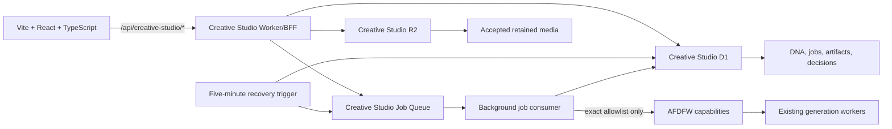

# Architecture

Creative Studio uses one product-owned contract from browser to storage:

## Ownership

- The frontend owns presentation and interaction only. It imports shared types but no Worker or AFDFW source.
- The BFF owns authentication handoff, validation, idempotent job creation, capability translation, and media mediation.
- The queue consumer owns generation submission and per-generation reconciliation. A scheduled sweep re-enqueues due jobs after delivery or runtime interruptions.
- Creative Studio D1 owns project metadata, CreativeDNA in every environment, jobs, artifact history, retained-media pointers, and append-only decisions.
- Creative Studio R2 owns accepted generated media.
- AFDFW provides an approved session plus generation submission/status and temporary media through exact routes.

## CreativeDNA vertical slice

1. A user supplies original intent or a labeled commercial reference.
2. The deterministic compiler normalizes eight shared dimensions and three gravity weights.
3. Commercial identity is retained as provenance but omitted from provider prompts.
4. Saving creates a root or child version without overwriting history.
5. Music and image translations create idempotent durable jobs tied to the exact DNA artifact, then return before generation starts.
6. The queue consumer submits to AFDFW and reconciles the individual upstream generation without a browser session. It retains only the verified Access email needed to resolve the approved AFDFW owner; browser cookies and Access JWTs are not stored.
7. Completion creates a reviewable artifact with job and DNA lineage.
8. Accept copies remote generated media into Creative Studio R2 before recording the explicit decision; reject and archive record decisions without copying media. None changes AFDFW canonical state.

## Adapters

- `development-local-storage` is deliberately visible and browser-scoped. Its media is a gradient placeholder.
- `creative-studio-bff` is backend-scoped. In Worker development mode, D1 metadata is durable across process restarts while generated media remains a placeholder.
- Production uses the `AFDFW` same-account service binding, dedicated D1/R2/Queue bindings, a five-minute recovery trigger, and Cloudflare Access over `cs.angelotoborg.com/*`.

## Job lifecycle guarantees

- Owner plus idempotency key has a D1 uniqueness constraint, so browser retries do not create a second Creative Studio job.
- Queue delivery is guarded by a D1 lease, and artifact creation is unique per job.
- Active jobs have a 30-minute deadline, bounded exponential reconciliation delay, and explicit terminal failure state.
- Retry creates a new job with `retryOfJobId` lineage; it never rewrites the failed or cancelled record.
- Cancel stops Creative Studio tracking. If AFDFW already handed work to ComfyUI, that upstream computation may still finish and is not represented as cancelled upstream.
