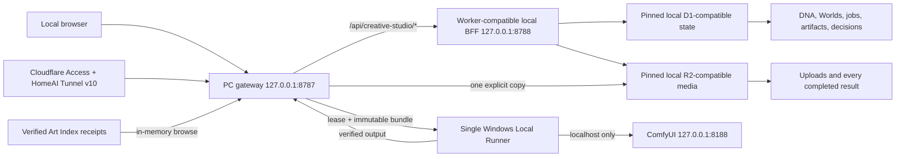

# Architecture

Creative Studio uses one product-owned contract and one authoritative runtime: Angelo's PC.

Localhost and `cs.angelotoborg.com` are verified doorways into the same PC host. The remote doorway is protected by Cloudflare Access and carried by HomeAI Tunnel v10 to `http://localhost:8787` without invoking a Cloudflare Worker. The deployed production retirement contract declares no Worker route/domain, D1/R2 binding, Queue producer/consumer, cron, preview URL, assets, or service binding. Historical cloud D1/R2 remain preserved read-only and are not a synchronization target.

## Ownership

- The frontend owns presentation and interaction only. It imports shared types but no Worker or AFDFW source.
- The loopback gateway owns local-session cookies, exact public-host and Access-owner admission, case-normalized host/origin and public-Runner-route checks, and Art Index mediation.
- The local BFF owns validation, idempotent job creation, durable domain rules, capability translation, and local media mediation.
- The pinned D1-compatible state owns project metadata, CreativeDNA, versioned Worlds/entities/rules/references, append-only canon promotions, upload metadata and consent, jobs, artifact history, retained-media pointers, and append-only review decisions.
- The pinned R2-compatible state owns owner-uploaded media and every completed generated result, independent of later acceptance decisions.
- The single Local Runner owns browser-independent execution of API-format ComfyUI workflows, CreativeDNA evidence synthesis, prompt enhancement, full-video-script writing, Story Bank, Overnight Studio, Love Loop, and supported local training. It authenticates with a local-only credential and cannot call owner routes or arbitrary paths.
- Browser refreshes and Runner claims terminate on the PC, so neither localhost nor remote use consumes Cloudflare Worker/D1/R2/Queue allowance.

## Observed cutover state

The 2026-09-03 migration receipt at `%LOCALAPPDATA%\Creative Studio Host\backups\20260903T130433Z\migration-receipt.json` records stable duplicate D1 snapshots, 25 migrations across 40 tables, successful SQLite integrity checks, zero foreign-key violations, and 233 of 233 referenced R2 objects totaling 315,823,973 bytes. It records no cloud write or deletion. The installed `Creative Studio PC Host` task is enabled and running, the legacy Runner task is disabled, listeners are bound to loopback ports `8787` and `8788`, and authenticated host health reports `ok` with `authority=this-pc`.

Cloudflare Worker version `4ae4c678-9c2f-48f9-993d-a82926b842f6` is deployed at 100% with only the fail-closed retirement variables and no application execution bindings. HomeAI Tunnel v10 places `cs.angelotoborg.com -> http://localhost:8787` before its catch-all, while DNS is recorded as `Tunnel` / `HomeAI` / `Proxied` / `Auto`. At cutover verification, independent Cloudflare/Google DoH answers contained `104.21.18.119` and `172.67.181.206`.

Anonymous remote access receives Access `302`. Authenticated desktop and 390-by-844 mobile sessions render Creative Studio; the mobile document and viewport widths are both 390 pixels, with no app-origin console messages. Art Index reports 1,767 eligible works, search `0015` returns three results, and the existing materialized `0015` remains usable. The live gateway contract returns `401` without trusted headers, `200` for the approved root, and `404` for the Runner route under otherwise approved headers.

The supported installer restart initially revealed a PID-reuse race. `Test-SameProcessIdentity`, the safe skip path, and `host:installer:check` now guard that boundary. Pending local migrations cannot run until the exact receipt-pinned SQLite database and migration ledger pass integrity checks and a separately verified recovery checkpoint is retained; failed or interrupted migration attempts restore that checkpoint and refuse a byte-identical failing plan. After the one explicit `0015` Archive materialization, the local store contains 234 objects and 321,901,818 bytes; the final controlled `host:install` restart preserved those local D1 counts/integrity and R2 totals unchanged. Post-cutover cloud analytics report zero D1 write queries and zero rows written; cloud R2 remains unchanged at 233 objects and 315,823,973 bytes. ComfyUI was offline, so this cutover verification did not exercise generation.

## Full Video Script

1. Exact dialogue remains directly editable in Create and does not require Gemma or a runner.
2. **Write full script** submits one or more owner seed phrases—or the current direction for polishing—together with the exact video model revision, prompt profile, source/input mode, and duration. Migration `0019_full_video_scripts.sql` preserves every v1 dialogue draft and adds the v2 context, separate generated/current dialogue, and source provenance fields.
3. Local Runner 1.12 claims `full-script-v2` under the existing renewable lease and runs Gemma 4 through the existing multimodal ComfyUI graph. Text-to-video removes media inputs; image-to-video materializes the exact owned source image, and video extension extracts its owned source's final frame before Gemma writes. One phrase must expand into a strict three-field JSON result: a complete model-specific visual/action/camera/environment/light/ending/nonverbal-sound direction plus separate optional `spokenText`. A one-line paraphrase is invalid.
4. MiniMax H3 receives a duration-bounded SHOT/Audio timeline and exact first-frame rule when a source exists. LTX 2.5 and generic video models receive chronological natural-language direction. Generated dialogue is forbidden unless the owner's evidence asks for speech, and dialogue is never embedded in the visual script because deterministic speech compilation inserts it later.
5. Completion produces one editable full-script field and one optional exact-dialogue field. Neither changes Create until **Use full script** is chosen; each later owner edit uses a compare-and-swap revision. Blank dialogue selects No dialogue while retaining sound and ambience.
6. Generation reloads the owner-scoped draft and verifies its current prompt, optional dialogue, revision, workflow/profile/input/source context, and compiled speech policy. Every output stamps the generated and applied scene, separate dialogue, builder and generation workflow revisions, source provenance and materialization, exact derived job prompt, derivation proof, model, and ComfyUI prompt ID. Multi-output variants keep both the common reviewed script and their distinct final prompts; arbitrary unrelated prompts cannot claim the reviewed script lineage.
7. Legacy `dialogue-v1` rows remain runnable on Local Runner 1.11; only Runner 1.12 can claim v2. The development adapter reports the feature unavailable and never fabricates a Gemma scene. No AFDFW route, generic proxy, cron, or Queue producer was added.

## CreativeDNA vertical slice

1. A user supplies original intent or a labeled commercial reference.
2. The deterministic compiler normalizes eight shared dimensions and three gravity weights.
3. Commercial identity is retained as provenance but omitted from provider prompts.
4. Saving creates a root or child version without overwriting history.
5. The primary image/music actions select a compatible imported API-format workflow, save the DNA translation into its primary prompt as an immutable revision, and create a durable `local-comfyui` job tied to that exact DNA and workflow revision.
6. The authenticated Local Runner claims the job and executes it through localhost ComfyUI without requiring the browser to remain open.
7. No missing local workflow falls through to AFDFW or another cloud execution path.
8. Completion creates a `retaining` artifact and writes the result to a deterministic local R2-compatible key. Only after size verification does the job become `completed` and the artifact become `ready`; for video, the runner then stores an independently bounded first-frame JPEG under the same artifact.

## Creative Worlds and character continuity

Creative Worlds add a structured continuity layer without making generation or review implicit:

1. An owned project can persist a versioned World and versioned character, place, or object entities.
2. Each entity can keep bounded aliases and facet/value attributes. Versioned `must`, `prefer`, and `avoid` rules can target selected entities and image, video, or music modalities.
3. Canon references retain source provenance, continuity notes, and a rights policy. Commercial-reference identity is permitted only in provenance and is excluded from provider prompt text.
4. A generation request selects the exact World, entity, rule, and canonical-reference versions that the owner inspected. The local BFF reloads every record under the authenticated owner and project, rejects missing, stale, retired, foreign, or noncanonical selections, and compiles the directive authoritatively.
5. Local ComfyUI image and video generation must contain that exact compiled suffix in the workflow's positive prompt. The resulting `GenerationSettingsStamp.continuity` freezes the selection, compiled directive, and complete versioned record snapshots. A later edit creates new current state without altering older generation evidence.
6. Music continuity is reserved in the shared contract but rejected by the current generation path. The retired cloud plane has no AFDFW generation binding.

Artifact review and World canon are independent state machines. Accepting a retained output controls CreativeDNA training eligibility only. Promoting it to canon is a second explicit, note-bearing action that requires an accepted decision, retained bytes, an active World/entity at the expected version, selected continuity facets, and the exact confirmation string. Promotion creates a canonical retained-artifact reference plus an append-only `CanonPromotion`; it never mutates AFDFW state.

## Cursor-safe artifact history

The consolidated snapshot is an operational window, not the archive transport. Complete history uses explicit keyset pages ordered by `created_at DESC, id DESC`. The cursor carries both values, which makes the boundary stable even when multiple artifacts share a timestamp. A page includes the matching artifacts plus their exact jobs, acceptance decisions, and CreativeDNA training examples, and supports project, modality, status, archived, and text filters. Stable D1 indexes back the same ordering. The browser keeps query-specific loaded IDs rather than treating the globally merged snapshot as a contiguous page; changing a project or filter invalidates in-flight responses, and grouped studies are projected and re-sorted from only the branches proven by that query.

Page requests are owner actions rather than a new polling loop. The browser continues to refresh only the bounded snapshot while visible active work exists; loading older history does not enlarge every refresh or add a cron, Queue producer, or runner claim.

## Art Index and explicit materialization

The Art Index remains a filesystem receipt, not an application database mirror. The verified receipt set describes 17,353 records and 1,767 currently materializable images. The gateway validates and loads it into memory, builds deterministic public IDs, and supports bounded search/filter pages without SQL writes.

Materialization begins only after the owner chooses one eligible entry and an active project. The gateway resolves the exact verified source, confirms it is still contained by the archive root and still matches the receipt, then uploads that one file into local project media using a deterministic ID and complete archive provenance. It never edits the archive, bulk-copies the catalog, inserts one D1 row per artwork, or sends archive paths/files to Cloudflare.

The old `0025_archive_index.sql` tables remain inert historical schema. Guards fingerprint that applied migration, reject runtime DML against its tables, reject later row-per-art catalog migrations, and reject the retired autonomous Runner sync markers. This directly prevents recurrence of the 17,353-row sync that produced 192,000 billed D1 writes.

## Adapters

- `development-local-storage` is deliberately visible and browser-scoped. Its media is a gradient placeholder.
- `creative-studio-bff` is backend-scoped and runs through Wrangler local mode against the pinned PC state. Local ComfyUI jobs retain real outputs; only the explicitly labeled UI development adapter remains non-media.
- The production browser build marks itself PC-hosted. It allows the fixed localhost and final Access-protected hostname and polls the PC host without reintroducing a Cloudflare execution plane.
- World edits, canon promotion, archive materialization, and older-history pages are explicit owner requests. The Local Runner uses one unified local work claim and folds its machine heartbeat into active job heartbeats.

## Media intake and training boundary

1. The browser sends an image, audio, or video file only to `/api/creative-studio/media` with the active project, original name, byte size, MIME type, and explicit future-training consent.
2. The local BFF validates ownership, project state, type, and the 100 MB limit before writing.
3. The local BFF streams the body to a project-scoped local R2-compatible key and verifies its stored size.
4. Local D1 metadata is committed only after verification, then the asset becomes available through an owner-scoped content route.
5. Consent and provenance make the asset eligible for a later training workflow. Intake itself never starts training. Creative Studio ComfyUI workflows may explicitly bind compatible retained uploads or generated artifacts to detected media inputs.

## CreativeDNA evidence synthesis

1. The owner starts an idempotent durable run from selected consented uploads, all explicitly training-ready accepted results in the project, and an optional base DNA version.
2. An authenticated Local Runner claims the exact bundle under a renewable two-minute lease. Owner-session routes cannot submit a fabricated completion payload.
3. The runner measures image pixels with Sharp, decodes bounded audio/video segments with the bundled local FFmpeg binary, and submits each selected upload to the bundled Gemma 4 multimodal ComfyUI graph. Image, audio, and video use explicit modality bindings; video supplies both decoded frames and its audio track.
4. Gemma returns a `longSummary` with the full observable-media analysis and a `shortSummary` containing the polished reusable generation prompt. Deterministic measurements, accepted-result prompt/settings context, and an optional base-DNA prior shape the eight CreativeDNA dimensions. Both summaries keep their model, prompt, workflow version, ComfyUI prompt ID, and inference settings as durable source provenance; only the short summary enters generation.
5. Each source produces the detailed description, bounded observations, primitive metrics, eight dimension values, and confidence. The runner aggregates the dimensions deterministically rather than treating free-form model text as authority.
6. The Worker canonicalizes source identity from D1, rejects missing, duplicate, foreign, malformed, or incomplete v1.1 evidence, preserves commercial-reference rights from the base version, and writes a new immutable DNA version with per-dimension provenance.
7. This phase is evidence-backed profile synthesis, not model-weight, LoRA, or foundation-model fine-tuning. The completed version remains behind the existing note-required human comparison and approval gate.

## Job lifecycle guarantees

- Owner plus idempotency key has a D1 uniqueness constraint, so browser retries do not create a second Creative Studio job.
- Local Runner claims are guarded by a D1 lease, and artifact creation is unique per job.
- Retention is idempotent at a deterministic local R2-compatible key. A failed or interrupted copy remains at 95% with a `retaining` artifact and is retried without regenerating upstream.
- Generation has a 30-minute deadline and bounded exponential reconciliation delay. A confirmed result awaiting retention continues retrying instead of being discarded at that generation deadline.
- Local workflow generation persists its actual start and stage transitions. Crossing 20 minutes creates an awareness warning but does not cancel ComfyUI; local history polling may continue through transient 15-second request timeouts up to the runner's 24-hour safety boundary.
- Retry creates a new job with `retryOfJobId` lineage; it never rewrites the failed or cancelled record.
- Cancel stops Creative Studio tracking only before a completed result enters retention. Once a result exists, retention cannot be cancelled.
- Local workflow jobs use the `local-comfyui` execution target and remain queued while the runner is offline; there is no Cloudflare Queue consumer.
- The one local Runner claims a job with a two-minute renewable lease. A restart or lost heartbeat makes the job reclaimable; deterministic artifact IDs and local R2 keys prevent duplicate retained results.
- ComfyUI history polling treats a temporarily busy or timed-out localhost endpoint as transient while continuing Creative Studio heartbeats. A retry after an eligible runner, output-download, or retention failure carries the prior ComfyUI prompt ID into a new lineage-linked job, avoiding duplicate GPU work.
- Exact workflow revision, SHA-256 hash, parameters, model names, media-parameter-to-asset bindings, DNA lineage, and retry lineage remain stamped on the job and artifact.
- Queue diagnostics combine those stamped workload facts with measured queue/execution time and completed runs from the exact immutable revision. They identify likely contributors without claiming a provider or node bottleneck that was not observed.

## Workflow-backed generation

1. Create lists executable API-format workflows from the authenticated owner's reusable model library and filters them by the selected output modality. The workflow's import project remains provenance only; choosing it never changes the active project.
2. Scalar prompt, seed, dimension, duration, sampler, scheduler, switch, and choice controls are editable in context. Changed values are saved as a new immutable workflow revision before the job is queued.
3. Every detected media input must bind to a compatible retained upload or retained generated artifact owned by the active job project. Jobs, DNA, inputs, artifacts, and decisions remain project-scoped even when the selected workflow was originally imported elsewhere.
4. The job stores the exact revision ID, content hash, parameter values, models, input bindings, and normalized upload/artifact input sources.
5. The runner downloads only those allowlisted inputs, patches only their detected API bindings, and submits the immutable graph to localhost ComfyUI.
6. Output selection prefers the modality-compatible save node from the submitted graph, so preview-node files cannot silently replace the intended result.
7. Completion writes and size-verifies the result in the pinned local R2-compatible store before exposing review, reuse, or CreativeDNA training evidence.
