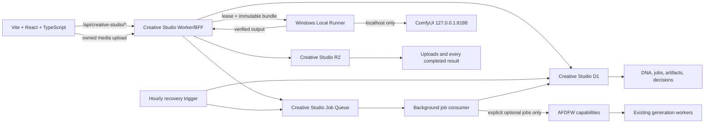

# Architecture

Creative Studio uses one product-owned contract from browser to storage:

The same typed contract has two explicit deployments:

- Local-first: Vite, Wrangler-local BFF, local D1/R2 state, Local Runner, and ComfyUI all stay on `127.0.0.1`. Real generation requires an imported API-format workflow and uses this machine's hardware. AFDFW and Cloudflare are not runtime dependencies.
- Remote: `cs.angelotoborg.com` uses the Cloudflare Worker, production D1/R2/Queue, and the authenticated workstation runner for Creative Studio ComfyUI generation. The narrow allowlisted AFDFW image/music capabilities remain separate optional routes that the owner must select explicitly.

Local and remote storage never synchronize implicitly. This prevents local experiments, large media, or review decisions from becoming cloud writes merely because both experiences use the same contracts.

## Ownership

- The frontend owns presentation and interaction only. It imports shared types but no Worker or AFDFW source.
- The BFF owns authentication handoff, validation, idempotent job creation, capability translation, and media mediation.
- The queue consumer owns only explicitly selected AFDFW submission and per-generation reconciliation. A scheduled sweep re-enqueues due AFDFW jobs after delivery or runtime interruptions; local workflow jobs are claimed by the Local Runner instead.
- Creative Studio D1 owns project metadata, CreativeDNA in every environment, upload metadata and consent, jobs, artifact history, retained-media pointers, and append-only decisions.
- Creative Studio R2 owns owner-uploaded media and every completed generated result, independent of later acceptance decisions.
- AFDFW provides an approved session plus generation submission/status and temporary media through exact routes.
- Local Runner 1.4 owns browser-independent execution of API-format ComfyUI workflows and CreativeDNA evidence synthesis. It cannot call owner routes, AFDFW, D1, R2, or arbitrary Worker paths directly.
- In local-first mode the runner and browser call only the localhost BFF; two-second UI refresh and five-second runner claims therefore consume no Cloudflare allowance. The remote build fails closed to the one-minute polling floor.

## CreativeDNA vertical slice

1. A user supplies original intent or a labeled commercial reference.
2. The deterministic compiler normalizes eight shared dimensions and three gravity weights.
3. Commercial identity is retained as provenance but omitted from provider prompts.
4. Saving creates a root or child version without overwriting history.
5. The primary image/music actions select a compatible imported API-format workflow, save the DNA translation into its primary prompt as an immutable revision, and create a durable `local-comfyui` job tied to that exact DNA and workflow revision.
6. The authenticated Local Runner claims the job and executes it through localhost ComfyUI without requiring the browser to remain open.
7. AFDFW image/music generation is a distinct optional action. Its request must explicitly name the `afdfw` provider; the Worker never falls through to AFDFW when no workflow was supplied.
8. Either completion path creates a `retaining` artifact and writes the result to a deterministic Creative Studio R2 key. Only after size verification does the job become `completed` and the artifact become `ready`; later review never changes AFDFW canonical state.

## Adapters

- `development-local-storage` is deliberately visible and browser-scoped. Its media is a gradient placeholder.
- `creative-studio-bff` is backend-scoped. In Worker development mode, D1 and the Wrangler-local R2 store are durable across process restarts. Local ComfyUI workflow jobs retain real outputs; only the explicitly labeled development renderer remains non-media.
- Production uses the `AFDFW` same-account service binding, dedicated D1/R2/Queue bindings, an hourly recovery trigger, and Cloudflare Access over `cs.angelotoborg.com/*`.
- The browser reads one consolidated Worker snapshot and polls only once per minute while durable work is active and the tab is visible. The Local Runner uses one unified work claim per idle minute and folds its machine heartbeat into active job heartbeats. The enforced free-plan baseline is at most 2,904 Worker invocations per day before explicit owner actions or active Queue deliveries.

## Media intake and training boundary

1. The browser sends an image, audio, or video file only to `/api/creative-studio/media` with the active project, original name, byte size, MIME type, and explicit future-training consent.
2. The Worker validates ownership, project state, type, and the 100 MB limit before writing.
3. The Worker streams the body to a project-scoped R2 key and verifies its stored size.
4. D1 metadata is committed only after verification, then the asset becomes available through an owner-scoped content route.
5. Consent and provenance make the asset eligible for a later training workflow. Intake itself never starts training. Creative Studio ComfyUI workflows may explicitly bind compatible retained uploads or generated artifacts to detected media inputs; optional AFDFW image/music generation remains CreativeDNA text-conditioned.

## CreativeDNA evidence synthesis

1. The owner starts an idempotent durable run from selected consented uploads, all explicitly training-ready accepted results in the project, and an optional base DNA version.
2. An authenticated Local Runner 1.4 claims the exact bundle under a renewable two-minute lease. Owner-session routes cannot submit a fabricated completion payload.
3. The runner measures image pixels with Sharp, decodes bounded audio/video segments with the bundled local FFmpeg binary, and submits each selected upload to the bundled Gemma 4 multimodal ComfyUI graph. Image, audio, and video use explicit modality bindings; video supplies both decoded frames and its audio track.
4. Gemma returns a `longSummary` with the full observable-media analysis and a `shortSummary` containing the polished reusable generation prompt. Deterministic measurements, accepted-result prompt/settings context, and an optional base-DNA prior shape the eight CreativeDNA dimensions. Both summaries keep their model, prompt, workflow version, ComfyUI prompt ID, and inference settings as durable source provenance; only the short summary enters generation.
5. Each source produces the detailed description, bounded observations, primitive metrics, eight dimension values, and confidence. The runner aggregates the dimensions deterministically rather than treating free-form model text as authority.
6. The Worker canonicalizes source identity from D1, rejects missing, duplicate, foreign, malformed, or incomplete v1.1 evidence, preserves commercial-reference rights from the base version, and writes a new immutable DNA version with per-dimension provenance.
7. This phase is evidence-backed profile synthesis, not model-weight, LoRA, or foundation-model fine-tuning. The completed version remains behind the existing note-required human comparison and approval gate.

## Job lifecycle guarantees

- Owner plus idempotency key has a D1 uniqueness constraint, so browser retries do not create a second Creative Studio job.
- Queue delivery is guarded by a D1 lease, and artifact creation is unique per job.
- Retention is idempotent at a deterministic R2 key. A failed or interrupted copy remains at 95% with a `retaining` artifact and is retried without regenerating upstream.
- Generation has a 30-minute deadline and bounded exponential reconciliation delay. A confirmed result awaiting retention continues retrying instead of being discarded at that generation deadline.
- Local workflow generation persists its actual start and stage transitions. Crossing 20 minutes creates an awareness warning but does not cancel ComfyUI; local history polling may continue through transient 15-second request timeouts up to the runner's 24-hour safety boundary.
- Retry creates a new job with `retryOfJobId` lineage; it never rewrites the failed or cancelled record.
- Cancel stops Creative Studio tracking only before a completed result enters retention. Once a result exists, retention cannot be cancelled.
- Local workflow jobs use a separate `local-comfyui` execution target, never enter the AFDFW queue consumer, and remain queued while the runner is offline.
- A paired runner claims one job with a two-minute renewable lease. A restart or lost heartbeat makes the job reclaimable; deterministic artifact IDs and R2 keys prevent duplicate retained results.
- ComfyUI history polling treats a temporarily busy or timed-out localhost endpoint as transient while continuing Creative Studio heartbeats. A retry after an eligible runner, output-download, or retention failure carries the prior ComfyUI prompt ID into a new lineage-linked job, avoiding duplicate GPU work.
- Exact workflow revision, SHA-256 hash, parameters, model names, media-parameter-to-asset bindings, DNA lineage, and retry lineage remain stamped on the job and artifact.
- Queue diagnostics combine those stamped workload facts with measured queue/execution time and completed runs from the exact immutable revision. They identify likely contributors without claiming a provider or node bottleneck that was not observed.

## Workflow-backed generation

1. Create lists executable API-format workflows from the authenticated owner's reusable model library and filters them by the selected output modality. The workflow's import project remains provenance only; choosing it never changes the active project.
2. Scalar prompt, seed, dimension, duration, sampler, scheduler, switch, and choice controls are editable in context. Changed values are saved as a new immutable workflow revision before the job is queued.
3. Every detected media input must bind to a compatible retained upload or retained generated artifact owned by the active job project. Jobs, DNA, inputs, artifacts, and decisions remain project-scoped even when the selected workflow was originally imported elsewhere.
4. The job stores the exact revision ID, content hash, parameter values, models, input bindings, and normalized upload/artifact input sources.
5. The runner downloads only those allowlisted inputs, patches only their detected API bindings, and submits the immutable graph to localhost ComfyUI.
6. Output selection prefers the modality-compatible save node from the submitted graph, so preview-node files cannot silently replace the intended result.
7. Completion writes and size-verifies the result in Creative Studio R2 before exposing review, reuse, or CreativeDNA training evidence.
