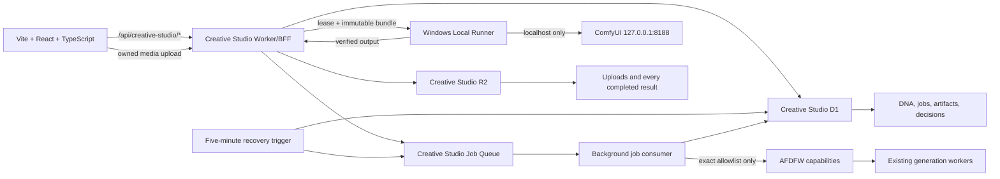

# Architecture

Creative Studio uses one product-owned contract from browser to storage:

## Ownership

- The frontend owns presentation and interaction only. It imports shared types but no Worker or AFDFW source.
- The BFF owns authentication handoff, validation, idempotent job creation, capability translation, and media mediation.
- The queue consumer owns generation submission and per-generation reconciliation. A scheduled sweep re-enqueues due jobs after delivery or runtime interruptions.
- Creative Studio D1 owns project metadata, CreativeDNA in every environment, upload metadata and consent, jobs, artifact history, retained-media pointers, and append-only decisions.
- Creative Studio R2 owns owner-uploaded media and every completed generated result, independent of later acceptance decisions.
- AFDFW provides an approved session plus generation submission/status and temporary media through exact routes.
- Local Runner 1.1 owns browser-independent execution of API-format ComfyUI workflows and CreativeDNA evidence synthesis. It cannot call owner routes, AFDFW, D1, R2, or arbitrary Worker paths directly.

## CreativeDNA vertical slice

1. A user supplies original intent or a labeled commercial reference.
2. The deterministic compiler normalizes eight shared dimensions and three gravity weights.
3. Commercial identity is retained as provenance but omitted from provider prompts.
4. Saving creates a root or child version without overwriting history.
5. Music and image translations create idempotent durable jobs tied to the exact DNA artifact, then return before generation starts.
6. The queue consumer submits to AFDFW and reconciles the individual upstream generation without a browser session. It retains only the verified Access email needed to resolve the approved AFDFW owner; browser cookies and Access JWTs are not stored.
7. Upstream completion creates a `retaining` artifact. The consumer streams the source into a deterministic owner/artifact R2 key, conditionally avoids overwriting an existing copy, verifies the stored size, and records the retained pointer.
8. Only after verification does the job become `completed` and the artifact become `ready`. Accept, reject, and archive then record decisions without changing retention or AFDFW canonical state.

## Adapters

- `development-local-storage` is deliberately visible and browser-scoped. Its media is a gradient placeholder.
- `creative-studio-bff` is backend-scoped. In Worker development mode, D1 and the Wrangler-local R2 store are durable across process restarts. Local ComfyUI workflow jobs retain real outputs; only the explicitly labeled development renderer remains non-media.
- Production uses the `AFDFW` same-account service binding, dedicated D1/R2/Queue bindings, a five-minute recovery trigger, and Cloudflare Access over `cs.angelotoborg.com/*`.

## Media intake and training boundary

1. The browser sends an image, audio, or video file only to `/api/creative-studio/media` with the active project, original name, byte size, MIME type, and explicit future-training consent.
2. The Worker validates ownership, project state, type, and the 100 MB limit before writing.
3. The Worker streams the body to a project-scoped R2 key and verifies its stored size.
4. D1 metadata is committed only after verification, then the asset becomes available through an owner-scoped content route.
5. Consent and provenance make the asset eligible for a later training workflow. Intake itself never starts training. Narrow AFDFW image/music generation remains CreativeDNA text-conditioned; imported local ComfyUI workflows may explicitly bind compatible retained uploads or generated artifacts to detected media inputs.

## CreativeDNA evidence synthesis

1. The owner starts an idempotent durable run from selected consented uploads, all explicitly training-ready accepted results in the project, and an optional base DNA version.
2. An authenticated Local Runner 1.1 claims the exact bundle under a renewable two-minute lease. Owner-session routes cannot submit a fabricated completion payload.
3. The runner measures image pixels with Sharp, decodes bounded audio/video segments with the bundled local FFmpeg binary, inspects container metadata, and folds retained accepted-result prompt/settings context into the corresponding source profile.
4. Each source produces bounded observations, primitive metrics, eight dimension values, and confidence. The runner aggregates those values deterministically, with the optional base DNA as a small lineage prior.
5. The Worker canonicalizes source identity from D1, rejects missing, duplicate, foreign, or malformed evidence, preserves commercial-reference rights from the base version, and writes a new immutable DNA version with per-dimension provenance.
6. This phase is evidence-backed profile synthesis, not model-weight, LoRA, or foundation-model fine-tuning. Human comparison/approval before activating a trained version is a later review phase.

## Job lifecycle guarantees

- Owner plus idempotency key has a D1 uniqueness constraint, so browser retries do not create a second Creative Studio job.
- Queue delivery is guarded by a D1 lease, and artifact creation is unique per job.
- Retention is idempotent at a deterministic R2 key. A failed or interrupted copy remains at 95% with a `retaining` artifact and is retried without regenerating upstream.
- Generation has a 30-minute deadline and bounded exponential reconciliation delay. A confirmed result awaiting retention continues retrying instead of being discarded at that generation deadline.
- Retry creates a new job with `retryOfJobId` lineage; it never rewrites the failed or cancelled record.
- Cancel stops Creative Studio tracking only before a completed result enters retention. Once a result exists, retention cannot be cancelled.
- Local workflow jobs use a separate `local-comfyui` execution target, never enter the AFDFW queue consumer, and remain queued while the runner is offline.
- A paired runner claims one job with a two-minute renewable lease. A restart or lost heartbeat makes the job reclaimable; deterministic artifact IDs and R2 keys prevent duplicate retained results.
- ComfyUI history polling treats a temporarily busy or timed-out localhost endpoint as transient while continuing Creative Studio heartbeats. A retry after an eligible runner, output-download, or retention failure carries the prior ComfyUI prompt ID into a new lineage-linked job, avoiding duplicate GPU work.
- Exact workflow revision, SHA-256 hash, parameters, model names, media-parameter-to-asset bindings, DNA lineage, and retry lineage remain stamped on the job and artifact.

## Workflow-backed generation

1. Generate lists only executable API-format workflows for the active project and modality.
2. Scalar prompt, seed, dimension, duration, sampler, scheduler, switch, and choice controls are editable in context. Changed values are saved as a new immutable workflow revision before the job is queued.
3. Every detected media input must bind to a compatible retained upload or retained generated artifact owned by the same project.
4. The job stores the exact revision ID, content hash, parameter values, models, input bindings, and normalized upload/artifact input sources.
5. The runner downloads only those allowlisted inputs, patches only their detected API bindings, and submits the immutable graph to localhost ComfyUI.
6. Output selection prefers the modality-compatible save node from the submitted graph, so preview-node files cannot silently replace the intended result.
7. Completion writes and size-verifies the result in Creative Studio R2 before exposing review, reuse, or CreativeDNA training evidence.
